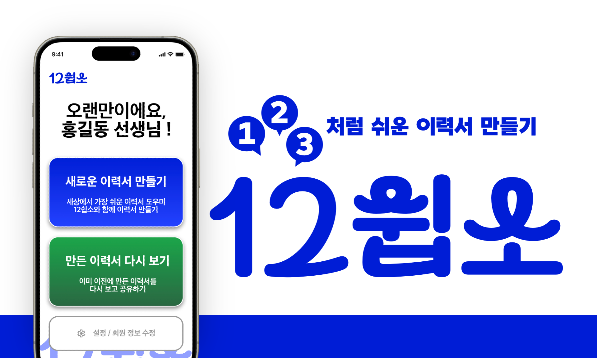
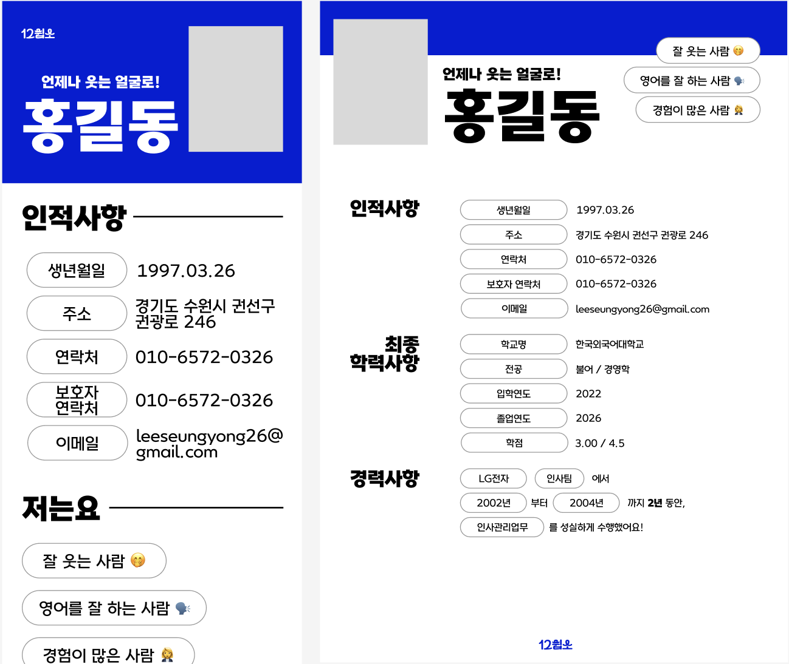
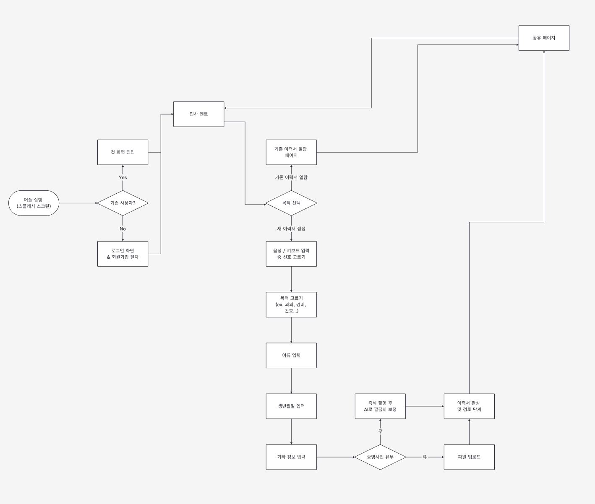
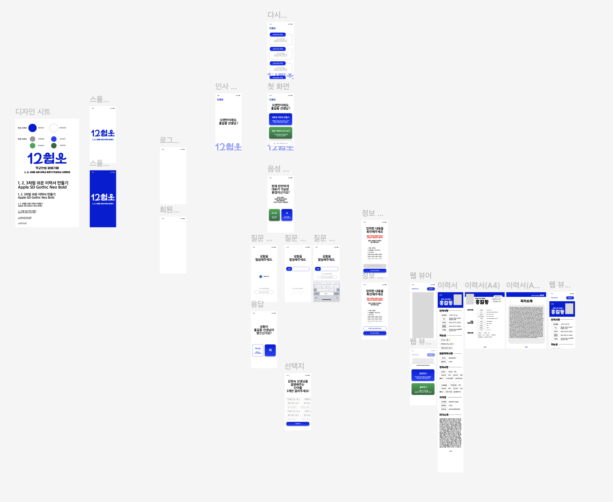

<body>
	
<br>
<br>
<nav>
	<h2>목차</h2>
	<ol>
		<li><a href="#overview">서비스 개요</a>
			<ol>
				<li><a href="#demovideo">시연 영상</a></li>
				<li><a href="#target">타겟 사용자</a></li>
				<li><a href="#members">구성 인원</a></li>
			</ol>
		</li>
		<li><a href="#features">기능</a>
			<ol>
				<li><a href="#keyfeatures">핵심 기능</a></li>
				<li><a href="#addfeatures">추가 구현 목표</a></li>
			</ol>
		</li>
		<li><a href="#develop">개발 진행</a>
			<ol>
				<li><a href="#structure">기술적 구조</a></li>
				<li><a href="#documents">산출물</a></li>
			</ol>
		</li>
		<li><a href="#opensource">오픈 소스 프로젝트로서의 12쉽소</a><ol>
				<li><a href="#possibility">도입 및 활용 가능성</a></li>
				<li><a href="#install">설치 가이드</a></li>
			</ol></li>
	</ol>
</nav>
<br>

<h2 id="overview"> 서비스 개요 </h2>
<p><ul>
	<li><b>“1, 2, 3처럼 쉬운 이력서 만들기"를 모토로, 디지털 취약계층을 대상으로 한 이력서 생성 서비스. </b></li>
	<li>대화형 UI를 통해 정보를 간단하고 편리하게 제공하면, 생성형 AI와 결합된 이력서를 최종적으로 산출</li>
	<li>해당 이력서를 모바일 웹 페이지 형식 혹은 실제 출력물 형태로 빠르게 공유 가능</li>
</ul></p>

<h3 id="demovideo"> 시연 영상 </h3>

[](https://www.youtube.com/watch?v=sDKRUIduR88)

<h3> 서비스 기획 동기 </h3>
<p>
	<ol>
		<li> <b> 내적 동기 </b> : 사회적 문제와 밀접하게 맞닿아 있는, 공공 문제 해결을 위한 프로젝트를 진행하고 싶은 구성원들의 의지 </li>
		<li> <b> 외적 동기 </b>
			<ul>
				<li> 초고령화 현상이 진행되면서 노인층의 일자리 문제가 대두 </li>
				<li> 구직에 꼭 필요한 것 중 하나가 바로 이력서 </li>
				<li> 이력서 작성에 어려움을 겪는 노년층이 많아, 각종 공공기관에서 교육 등을 실행하고 있음 </li>
			</ul>
		</li>
	</ol>
</p>

<h3 id="target"> 타겟 사용자 </h3>
<p>
	<ol>
		<li> 이력서 작성의 <b>개념 자체를 어려워하는 노년층</b> 등 </li>
		<li> 이력서에 대해서는 충분히 알고 있지만, 디지털로 작성하는 데에 어려움을 겪는 <b>디지털 취약 계층</b> </li>
	</ol>
</p>

<h3 id="members"> 구성원 </h3>
<p>
	<ol>
		<li> 한국외국어대학교 Software&AI를 이중전공하는 학생 4명으로 구성</li>
		<li> <b>구성인원</b> (팀장 외 가나다순) <br>
				<table>
					<tr> <td> <b>이승용</b> </td> <td> 언어인지과학과 </td> <td> 팀장 </td> <td> 프로젝트 기획 전반, UX 설계, HTML파트 코딩 </td> </tr>
					<tr> <td> <b>공예진</b> </td> <td> 브라질학과 </td> <td> - </td> <td> 백엔드 및 프론트엔드, 개발 총괄 </td> </tr>
					<tr> <td> <b>이하영</b> </td> <td> 체코슬로바키아어과 </td> <td> - </td> <td> 프론트엔드(Flutter) </td> </tr>
					<tr> <td> <b>정민서</b> </td> <td> GBT학부 </td> <td> - </td> <td> 백엔드(Spring, MySQL) </td> </tr>
				</table>
		</li>
	</ol>
</p>
<br>
<br>

<h2 id="features"> 기능 </h2>

<h3 id="keyfeatures">핵심 기능 </h3>

<p>
	<ul>
		<li>대화형 UI를 통해 이용자의 정보를 제공 받아 이력서를 생성
			<ul>
				<li> 사용자의 정보를 기반으로 자기소개까지 AI를 통해 자동 생성 </li>
				<li> 기생성된 모바일/A4 출력 HTML 템플릿에 입력받은 정보를 자동으로 채워 출력 </li>
				<li> <a href="https://1210so.github.io/resumeMobileHTML/resume_1_1717997428561.html"> A4 출력용 예시 페이지 </a> </li>
				<li> <a href="https://1210so.github.io/resumeMobileHTML/emptyResume_1_1717959473281.html"> 모바일 공유용 예시 페이지 </a> </li>
			</ul>
		</li>
		<li>쉽고 빠른 공유 기능 제공
			<ul>
				<li> 생성된 이력서 페이지는 카카오톡 등으로 쉽고 빠르게 공유 가능 </li>
				<li> 혹은 사용자에 따라 pdf로 다운 받아 바로 출력할 수 있도록 파일 제공 </li>
				<li> 모바일과 출력 환경에 맞는 두개의 템플릿 제공 </li>
			</ul>
		</li>
	</ul>
</p>

<h3 id="addfeatures">추가 구현 목표 </h3>
<p>
	<ul>
		<li> 오픈소스 프로젝트로서 필수적인 보안 요소 확충 </li>
		<li> 생성된 이력서 정보를 기반으로 웹 크롤링을 실행, 사용자에게 적합한 일자리를 자동으로 추천 </li>
		<li> 노인 일자리가 필요한 사용자와 구직자를 편리하게 매칭할 수 있는 서비스로 발전 </li>
		<li> 태블릿과 프린터를 결합한 키오스크 형태의 기기를 통해 공공기관 등에 배치 가능할 수 있도록 프로그래밍 </li>
	</ul>
</p>
<br>
<br>

<h2 id="develop"> 개발 진행 </h2>

<h3 id="structure"> 기술적 구조 </h3>
<p>
	<ul>
		<li> <b>프론트엔드</b> :  </li> 
		<li> <b>백엔드</b>
			<ol> 
				<li> 서버 :  </li>
				<li> DB :  (추후 DB 구현 예정) </li>
			</ol>
		</li>
	</ul>
</p>

<h3 id="plan"> 구현 계획 </h3>
<p>
	<ul>
		<li> <b> 이력서 생성 및 공유 등 핵심 기능 </b> : ~ 8월 27일 </li>
		<li> <b> 웹 크롤링 등 추가 기능 및 심미적 부분 </b>: ~ 11월</li>
		<li> <b> 태블릿과 프린터를 결합한 형태를 상정한 자동 키오스크 기기로서의 프로그래밍 </b> : ~ 10월 </li>
	</ul>
</p>

<h3 id="documents"> 산출물 </h3>
<p>
	<ol>
		<li>  <br> 
			<b> <a href="https://www.figma.com/design/KkZ2lSWDFk2kUNPaW08VKe/%EC%9D%B4%EB%A0%A5%EC%84%9C-%2F-Flow-Chart?node-id=1-223&t=BXzbot8PLdQ2gWqF-1"> User Flow </a> </b> </li>
		<li>  <br> 
			<b> <a href="https://www.figma.com/design/v0zkPv187KX5iAtcJvVVM6/12%EC%89%BD%EC%86%8C?node-id=0-1&t=5BL4KGdNzo9ESjE3-1"> UI Wireframe </a> </b> </li>
		<li> <b> FRD </b> </li>
		<li> <b> 종합 설계 수업 중 발표 자료 </b>
			<ul> 
				<li> <a href="https://drive.google.com/file/d/1vWdn5HmQHapiD-9cr7NEcEEaKaIIOe1Z/view?usp=sharing">중간 발표</a> </li>
				<li> <a href="https://drive.google.com/file/d/16YtYWO3oE1WHBUoNOHxUGMxsvIDFhwx8/view?usp=sharing">최종 발표</a> </li>
			</ul>
		</li>
	</ol>
</p>

<h2 id="opensource"> 오픈소스 프로젝트로서의 12쉽소 </h2>
<h3 id="possibility"> 도입 및 활용 가능성 </h3>
<p>
	<ul>
		<li> 공공기관 : 태블릿과 프린터가 결합된 키오스크 형태로 설치하여 노년층을 위한 이력서 작성 툴로 배치 가능 </li>
		<li> 비영리기관 : 사회 취약계층 지원 프로그램에 쉽게 통합하여 이력서 작성 교육을 제공 </li>
		<li> * 12쉽소는 모든 기여를 환영하는 오픈소스 프로젝트입니다. </li>
	</ul>
</p>
<h3 id="install">설치 가이드</h3>

### 1. 시스템 요구 사항

<ul>
  <li><b>Flutter SDK</b>: <code>>=3.3.3 <4.0.0</code></li>
  <li><b>Android SDK</b>: 최소 버전 <code>21</code></li>
  <li><b>iOS SDK</b>: iOS 9.0 이상</li>
  <li><b>Java</b>: <code>21</code></li>
  <li><b>Spring Boot</b>: <code>3.2.4</code></li>
  <li><b>MySQL</b>: 5.7 이상</li>
</ul>

### 2. 프로젝트 클론
<ol start="2">
  <li>SpringBoot 클론</li>
</ol>

```bash
git clone https://github.com/1210so/server.git
cd server
```

<ol start="2">
  <li>Flutter 클론</li>
</ol>

```bash
git clone https://github.com/1210so/flutter.git
cd flutter
```

### 3. Flutter 앱 설정

<ol>
  <li>Flutter SDK를 설치하고 환경 변수를 설정합니다. (<a href="https://docs.flutter.dev/get-started/install">Flutter 설치 가이드</a> 참조)</li>
  <li>필요한 패키지 설치</li>
</ol>

```bash
flutter pub get
```

<ol start="3">
  <li>Android 또는 iOS 기기에서 앱을 실행</li>
</ol>

```bash
flutter run
```

### 4. Spring Boot 백엔드 설정

<ol>
  <li>프로젝트의 <code>server</code> 디렉토리로 이동</li>
</ol>

```bash
cd server
```

<ol start="2">
  <li>필요한 의존성을 설치</li>
</ol>

```bash
./mvnw clean install
```

<ol start="3">
  <li>Spring Boot 애플리케이션을 실행</li>
</ol>

```bash
./mvnw spring-boot:run
```

<p>참고: 현재는 데이터베이스 연결이 설정되지 않아, 메모리 기반 저장소를 사용하여 데이터를 관리하고 있음.</p>

### 5. 환경 변수 설정

<p><code>/src/main/resources</code>에 <code>application.properties</code> 파일을 생성하고 다음 내용을 추가</p>

```env
openai.secret-key=YOUR_OPENAI_SECRET_KEY
openai.url.prompt=https://api.openai.com/v1/chat/completions
logging.level.root=debug
server.port=

github.token=YOUR_GITHUB_TOKEN
github.username=YOUR_GITHUB_USERNAME
github.repo=resumeMobileHTML
```

<p><code>YOUR_OPENAI_SECRET_KEY</code>, <code>YOUR_GITHUB_TOKEN</code>, <code>YOUR_GITHUB_USERNAME</code> 값을 실제 환경 변수로 대체</p>

### 6. 이력서 생성 및 테스트

<p>앱이 정상적으로 실행되면, UI를 통해 이력서를 생성하고 공유 기능을 테스트할 수 있음. Flutter 앱에서 이력서를 생성하고 PDF로 출력하거나, 다양한 방식으로 공유 가능.</p>


</body>

***

*written by. 이승용 (2024.08.24)*
